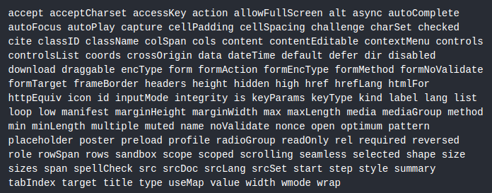

# React DOM
Este es un paquete que simplifica la interaccion y la actualizacion del DOM

## DOM
El DOM se lo define como Document Object Model, este es una representacion de los elementos en la web.

## Atributos del DOM reconocidos por React

